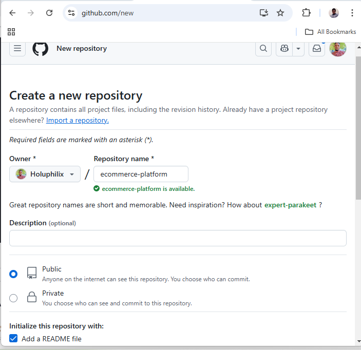
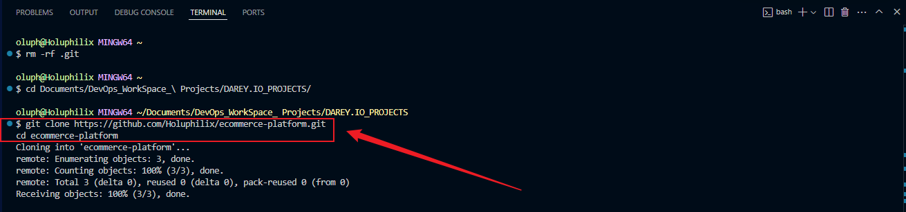
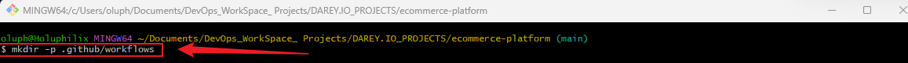
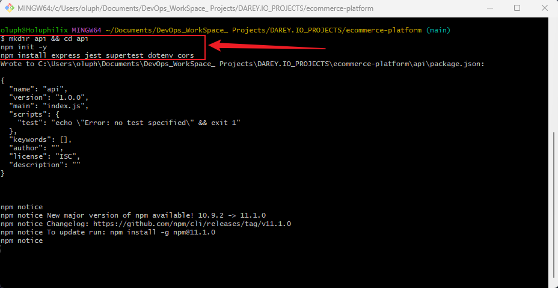
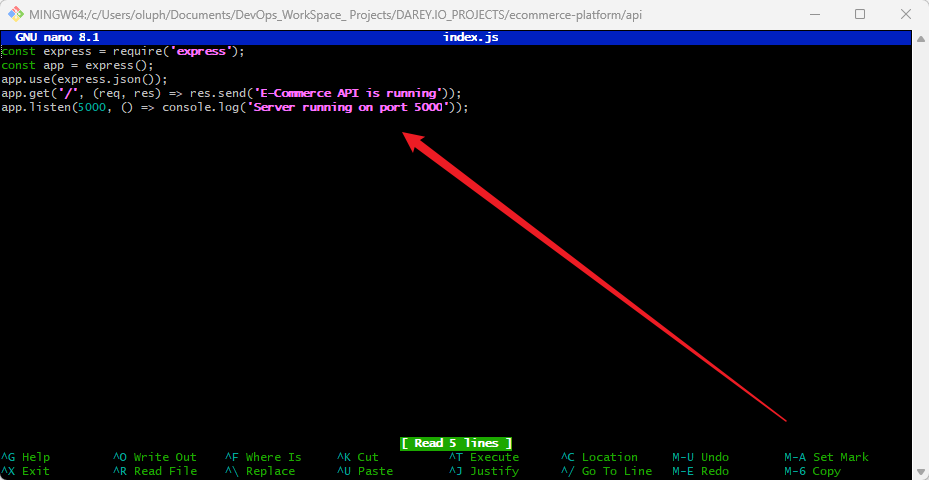
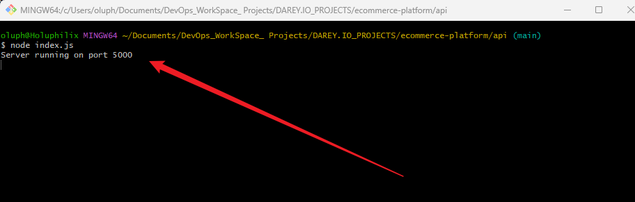
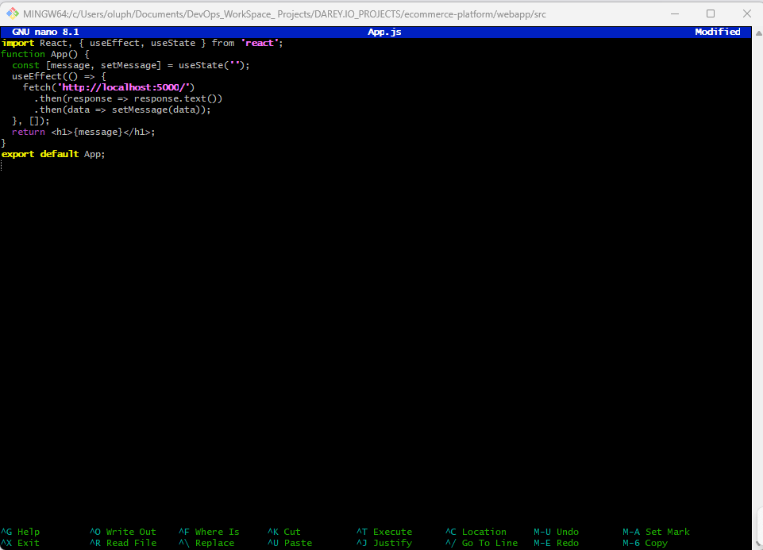
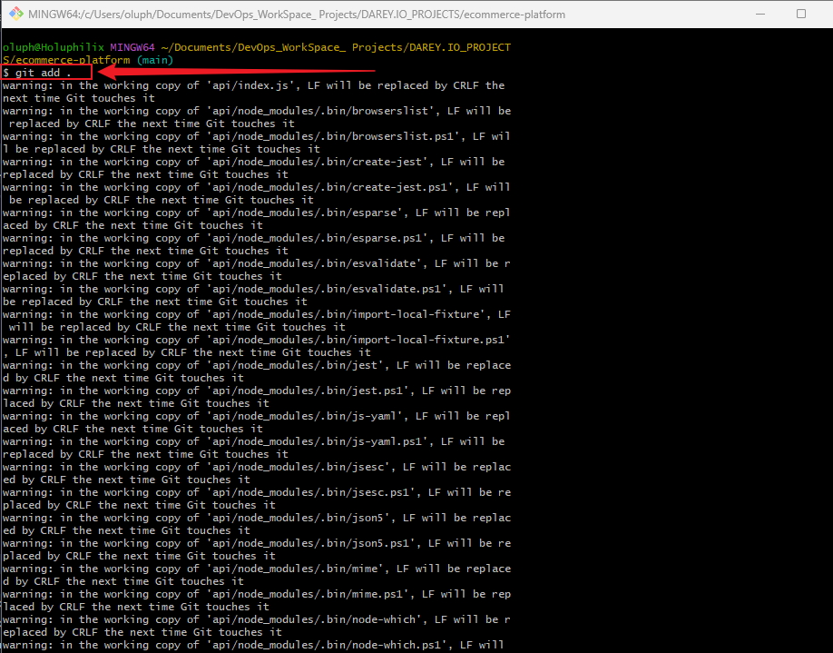

# Capstone Project: E-Commerce Application CI/CD Pipeline

## 📌 Project Overview
This project focuses on automating the CI/CD pipeline for an **E-Commerce Platform**. The platform consists of two primary components:

- **E-Commerce API**: A backend service built with Node.js and Express that handles product listings, user accounts, and order processing.
- **E-Commerce Frontend**: A web application built with React for users to browse products, manage accounts, and place orders.

The goal is to implement **Continuous Integration (CI)** and **Continuous Deployment (CD)** using **GitHub Actions** and deploy to **AWS** using **Docker containers**.


## 🛠️ Prerequisites
Before you begin, ensure you have the following installed:

- [Node.js (LTS)](https://nodejs.org/)
- [npm (Node Package Manager)](https://www.npmjs.com/)
- [Git](https://git-scm.com/)
- [Docker](https://www.docker.com/)
- An **AWS Account** for deployment
- A **GitHub Repository**


## 🚀 Project Tasks:

### Task 1️⃣: Project Setup

#### **Create a new GitHub repository named `ecommerce-platform`**

**Screenshot :** Git Clone the Repository


#### **Clone the Repository**

```sh
git clone https://github.com/Holuphilix/ecommerce-platform.git
cd ecommerce-platform
```
**Screenshot :** Git Clone the Repository


### Task 2️⃣: Initialize GitHub Actions
```sh
mkdir -p .github/workflows
```
**Screnshot :** Make a Github/workflow Directory


### Task 3️⃣: Backend API Setup

```sh
mkdir api && cd api
npm init -y
npm install express jest supertest dotenv cors
```
**Screenshot:** Create and Navigate into directory & Install express


#### **Create an `index.js` file inside `api`:**
```javascript
const express = require('express');
const app = express();
app.use(express.json());
app.get('/', (req, res) => res.send('E-Commerce API is running'));
app.listen(5000, () => console.log('Server running on port 5000'));
```
**Screenshot:** Create and Navigate into directory & Install express


#### **Run the backend server:**
```sh
node index.js
```
**Screenshot:** Check node index.js


###  Task 4️⃣: 🏗️ Frontend Web Application Setup

#### **Create React Application**

```sh
cd ..
npx create-react-app webapp
cd webapp
npm start
```
**Screenshot:** Make webapp Directory & npm start


#### **Modify `src/App.js` to fetch from the backend:**

```javascript
import React, { useEffect, useState } from 'react';
function App() {
  const [message, setMessage] = useState('');
  useEffect(() => {
    fetch('http://localhost:5000/')
      .then(response => response.text())
      .then(data => setMessage(data));
  }, []);
  return <h1>{message}</h1>;
}
export default App;
```
**Screenshot:** Modify App.js 
 


### Task 5️⃣: 🔄 Continuous Integration Workflow (GitHub Actions)

#### **Create a CI Workflow for Backend (`.github/workflows/backend-ci.yml`)**

```yaml
name: Backend CI
on: [push]
jobs:
  test:
    runs-on: ubuntu-latest
    steps:
      - name: Checkout Repository
        uses: actions/checkout@v3
      - name: Set up Node.js
        uses: actions/setup-node@v3
        with:
          node-version: 16
      - name: Install Dependencies
        run: |
          cd api
          npm install
      - name: Run Tests
        run: |
          cd api
          npm test
```

#### **Create a CI Workflow for Frontend (`.github/workflows/frontend-ci.yml`)**

```yaml
name: Frontend CI
on: [push]
jobs:
  test:
    runs-on: ubuntu-latest
    steps:
      - name: Checkout Repository
        uses: actions/checkout@v3
      - name: Set up Node.js
        uses: actions/setup-node@v3
        with:
          node-version: 16
      - name: Install Dependencies
        run: |
          cd webapp
          npm install
      - name: Build Application
        run: |
          cd webapp
          npm run build
```

### Task 6️⃣: 🐳 Docker Integration
#### **Create Dockerfile for Backend (`api/Dockerfile`)**

```dockerfile
FROM node:16
WORKDIR /app
COPY package.json .
RUN npm install
COPY . .
CMD ["node", "index.js"]
EXPOSE 5000
```

#### **Create Dockerfile for Frontend (`webapp/Dockerfile`)**

```dockerfile
FROM node:16
WORKDIR /app
COPY package.json .
RUN npm install
COPY . .
RUN npm run build
CMD ["npm", "start"]
EXPOSE 3000
```

### Task7️⃣: 🚀 Deploying to AWS
#### **Configure Deployment in GitHub Actions (`.github/workflows/deploy.yml`)**
- In this task, we manually deploy the Docker images to an AWS EC2 instance by building and pushing the images to Docker Hub, then SSHing into the EC2 instance to pull and run the containers with the necessary environment variables.
  
```yaml
name: Deploy to AWS EC2 with Docker

on:
  workflow_dispatch:  # This triggers the workflow manually from the GitHub Actions UI.

jobs:
  deploy:
    runs-on: ubuntu-latest

    steps:
      # Step 1: Checkout the repository
      - name: Checkout code
        uses: actions/checkout@v3

      # Step 2: Set up Node.js
      - name: Set up Node.js
        uses: actions/setup-node@v3
        with:
          node-version: '18'

      # Step 3: Install dependencies
      - name: Install dependencies
        run: |
          cd api
          npm install

      # Step 4: Run tests
      - name: Run tests
        run: |
          cd api
          npm test

      # Step 5: Log in to Docker Hub
      - name: Log in to Docker Hub
        uses: docker/login-action@v2
        with:
          username: ${{ secrets.DOCKER_HUB_USERNAME }}
          password: ${{ secrets.DOCKER_HUB_TOKEN }}

      # Step 6: Build Docker images
      - name: Build Docker images
        run: |
          docker build -t ${{ secrets.DOCKER_HUB_USERNAME }}/ecommerce-backend:latest ./api
          docker build -t ${{ secrets.DOCKER_HUB_USERNAME }}/ecommerce-frontend:latest ./webapp

      # Step 7: Push Docker images to Docker Hub
      - name: Push Docker images
        run: |
          docker push ${{ secrets.DOCKER_HUB_USERNAME }}/ecommerce-backend:latest
          docker push ${{ secrets.DOCKER_HUB_USERNAME }}/ecommerce-frontend:latest

      # Step 8: Install Docker on EC2 if not installed
      - name: Install Docker on EC2 if not installed
        uses: appleboy/ssh-action@v0.1.10
        with:
          host: ${{ secrets.EC2_HOST }}
          username: ec2-user
          key: ${{ secrets.EC2_SSH_PRIVATE_KEY }}
          script: |
            if ! command -v docker &> /dev/null; then
              echo "Docker not found, installing..."
              sudo yum install -y docker
              sudo service docker start
              sudo systemctl enable docker
            fi

      # Step 9: Deploy to AWS EC2 via SSH
      - name: Deploy to AWS EC2
        uses: appleboy/ssh-action@v0.1.10
        with:
          host: ${{ secrets.EC2_HOST }}
          username: ec2-user
          key: ${{ secrets.EC2_SSH_PRIVATE_KEY }}
          script: |
            # Stop and remove old containers
            docker stop ecommerce-backend || true
            docker stop ecommerce-frontend || true
            docker rm ecommerce-backend || true
            docker rm ecommerce-frontend || true
            
            # Pull new Docker images from Docker Hub
            docker pull ${{ secrets.DOCKER_HUB_USERNAME }}/ecommerce-backend:latest
            docker pull ${{ secrets.DOCKER_HUB_USERNAME }}/ecommerce-frontend:latest
            
            # Run the new Docker containers with environment variables
            docker run -d -p 5000:5000 --name ecommerce-backend -e API_SECRET_KEY=${{ secrets.API_SECRET_KEY }} ${{ secrets.DOCKER_HUB_USERNAME }}/ecommerce-backend:latest
            docker run -d -p 3000:3000 --name ecommerce-frontend ${{ secrets.DOCKER_HUB_USERNAME }}/ecommerce-frontend:latest
```

### Task 8️⃣:📡 Continuous Deployment
#### **Set up Auto-Deployment on AWS EC2**

- This task automates the deployment process, configuring GitHub Actions to automatically deploy updates to the AWS EC2 instance whenever changes are pushed to the main branch, ensuring continuous delivery of the latest code.

```yaml
name: Deploy to AWS EC2

on:
  push:
    branches:
      - main   # Trigger the workflow when there are changes pushed to the `main` branch

jobs:
  deploy:
    runs-on: ubuntu-latest

    steps:
      # Step 1: Checkout the repository
      - name: Checkout code
        uses: actions/checkout@v3

      # Step 2: Set up Node.js
      - name: Set up Node.js
        uses: actions/setup-node@v3
        with:
          node-version: '18'

      # Step 3: Install dependencies
      - name: Install dependencies
        run: |
          cd api
          npm install

      # Step 4: Run tests
      - name: Run tests
        run: |
          cd api
          npm test

      # Step 5: Log in to Docker Hub
      - name: Log in to Docker Hub
        uses: docker/login-action@v2
        with:
          username: ${{ secrets.DOCKER_HUB_USERNAME }}
          password: ${{ secrets.DOCKER_HUB_TOKEN }}

      # Step 6: Build Docker images
      - name: Build Docker images
        run: |
          docker build -t ${{ secrets.DOCKER_HUB_USERNAME }}/ecommerce-backend:latest ./api
          docker build -t ${{ secrets.DOCKER_HUB_USERNAME }}/ecommerce-frontend:latest ./webapp

      # Step 7: Push Docker images to Docker Hub
      - name: Push Docker images
        run: |
          docker push ${{ secrets.DOCKER_HUB_USERNAME }}/ecommerce-backend:latest
          docker push ${{ secrets.DOCKER_HUB_USERNAME }}/ecommerce-frontend:latest

      # Step 8: Install Docker on EC2 if not installed
      - name: Install Docker on EC2 if not installed
        uses: appleboy/ssh-action@v0.1.10
        with:
          host: ${{ secrets.EC2_HOST }}
          username: ec2-user
          key: ${{ secrets.EC2_SSH_PRIVATE_KEY }}
          script: |
            if ! command -v docker &> /dev/null; then
              echo "Docker not found, installing..."
              sudo yum install -y docker
              sudo service docker start
              sudo systemctl enable docker
            fi

      # Step 9: Deploy to AWS EC2 via SSH
      - name: Deploy to AWS EC2
        uses: appleboy/ssh-action@v0.1.10
        with:
          host: ${{ secrets.EC2_HOST }}
          username: ec2-user
          key: ${{ secrets.EC2_SSH_PRIVATE_KEY }}
          script: |
            # Stop and remove old containers
            docker stop ecommerce-backend || true
            docker stop ecommerce-frontend || true
            docker rm ecommerce-backend || true
            docker rm ecommerce-frontend || true
            
            # Pull new Docker images from Docker Hub
            docker pull ${{ secrets.DOCKER_HUB_USERNAME }}/ecommerce-backend:latest
            docker pull ${{ secrets.DOCKER_HUB_USERNAME }}/ecommerce-frontend:latest
            
            # Run the new Docker containers with environment variables
            docker run -d -p 5000:5000 --name ecommerce-backend -e API_SECRET_KEY=${{ secrets.API_SECRET_KEY }} ${{ secrets.DOCKER_HUB_USERNAME }}/ecommerce-backend:latest
            docker run -d -p 3000:3000 --name ecommerce-frontend ${{ secrets.DOCKER_HUB_USERNAME }}/ecommerce-frontend:latest
```

### Task 9️⃣: Version Control with Git 

- **Stage Your Changes:** Once you've made the changes, stage the files you modified. You can add them individually, or if you've only changed the slide image, you can stage everything with.

```sh

**Screenshot:** Stage Changes


- **Commit Your Changes:** After staging, commit your changes with a clear message describing the update.

**Screenshot:** Commit Changes


- **Push Changes to Remote Main Branch:** Push your changes to the remote main branch to keep everything updated.

## 📷 Screenshots
Place screenshots here:


## 🛠 Troubleshooting
### **🔴 Docker Not Found?**
```sh
sudo apt update && sudo apt install -y docker.io
```

### **🔴 Permission Denied (SSH)?**
```sh
chmod 600 your-key.pem
```

### **🔴 GitHub Actions Failing?**
- Ensure GitHub Secrets are correctly set up.
- Check AWS permissions.


## 📜 License
This project is licensed under the **MIT License**.


## 🙌 Contributors
- **[Your Name]** ([GitHub](https://github.com/your-username))

🚀 **Happy Coding!** 🎉

