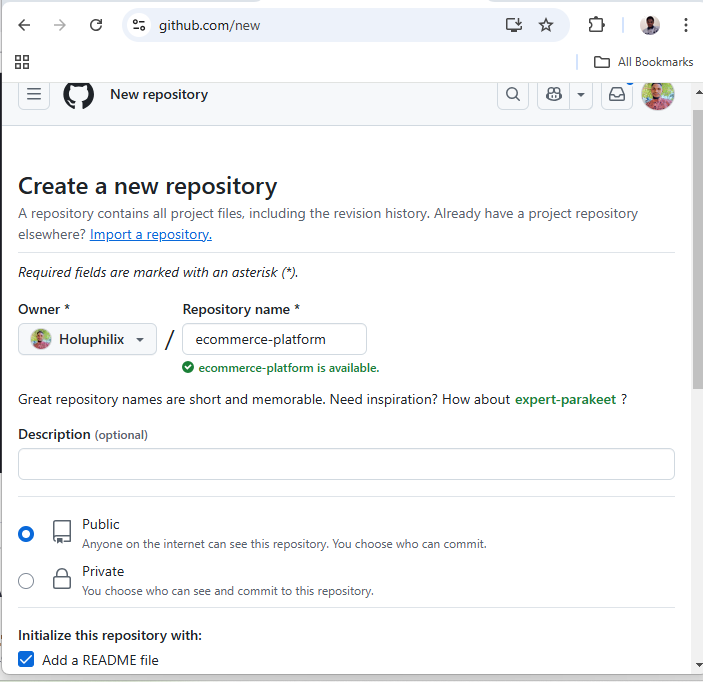
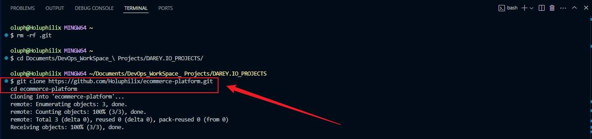
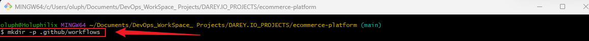
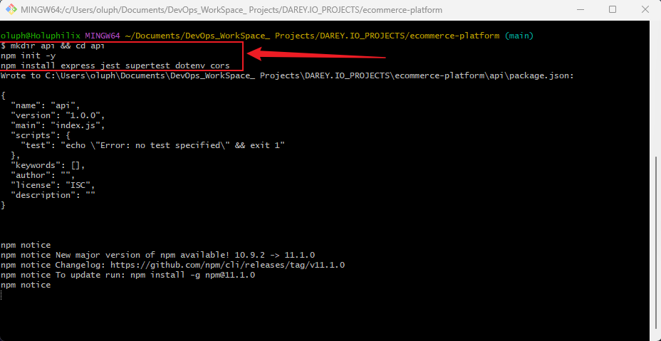
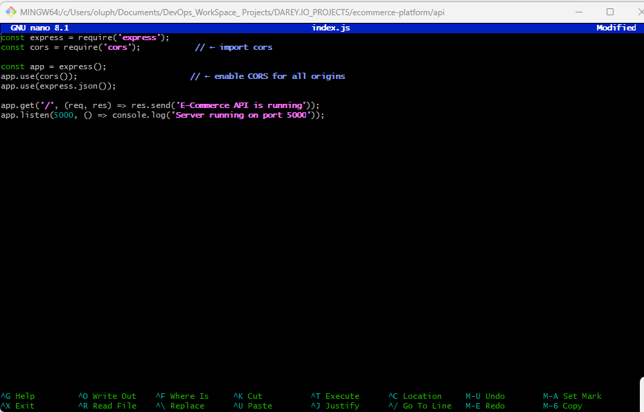
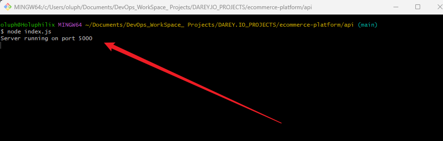
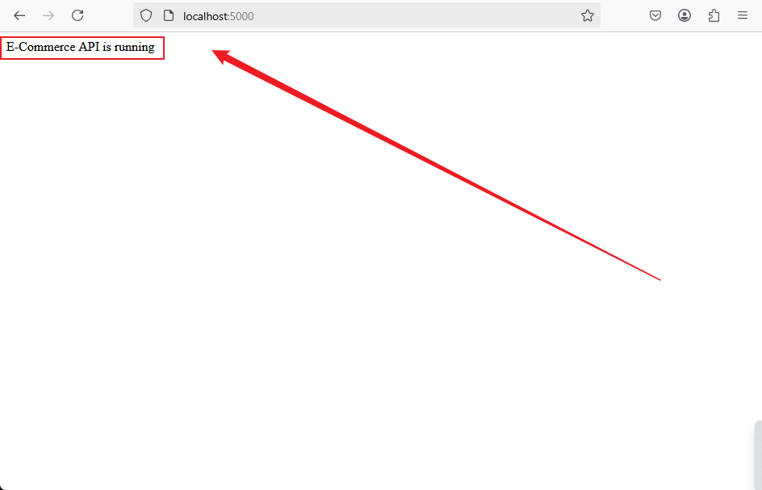
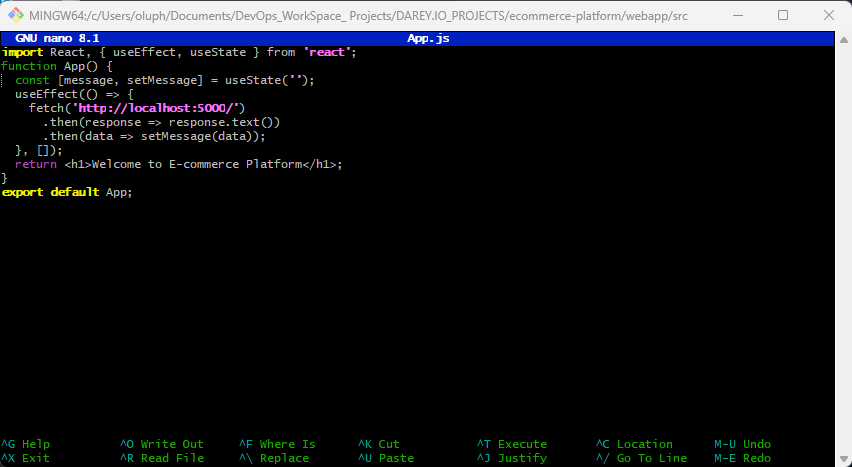
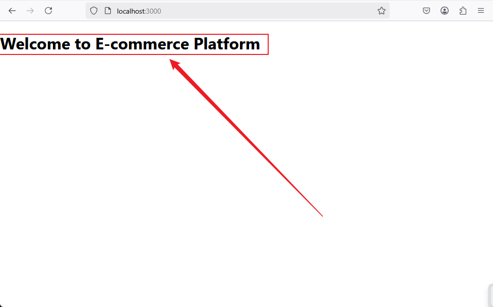

# Capstone Project: E-Commerce Application CI/CD Pipeline

## 📌 Project Overview
This project focuses on automating the CI/CD pipeline for an **E-Commerce Platform**. The platform consists of two primary components:

- **E-Commerce API**: A backend service built with Node.js and Express that handles product listings, user accounts, and order processing.
- **E-Commerce Frontend**: A web application built with React for users to browse products, manage accounts, and place orders.

The goal is to implement **Continuous Integration (CI)** and **Continuous Deployment (CD)** using **GitHub Actions** and deploy to **AWS** using **Docker containers**.


## 🛠️ Prerequisites
Before you begin, ensure you have the following installed:

- [Node.js (LTS)](https://nodejs.org/)
- [npm (Node Package Manager)](https://www.npmjs.com/)
- [Git](https://git-scm.com/)
- [Docker](https://www.docker.com/)
- An **AWS Account** for deployment
- A **GitHub Repository**


## 🚀 Project Tasks:

### Task 1️⃣: Project Setup

#### **Create a new GitHub repository named `ecommerce-platform`**

**Screenshot :** Git Clone the Repository


#### **Clone the Repository**

```sh
git clone https://github.com/Holuphilix/ecommerce-platform.git
cd ecommerce-platform
```
**Screenshot :** Git Clone the Repository


### Task 2️⃣: Initialize GitHub Actions
```sh
mkdir -p .github/workflows
```
**Screnshot :** Make a Github/workflow Directory


### Task 3️⃣: Backend API Setup

```sh
mkdir api && cd api
npm init -y
npm install express jest supertest dotenv cors
```
**Screenshot:** Create and Navigate into directory & Install express


#### **Create an `index.js` file inside `api`:**
```javascript
const express = require('express');
const cors = require('cors');           // ← import cors

const app = express();
app.use(cors());                       // ← enable CORS for all origins
app.use(express.json());

app.get('/', (req, res) => res.send('E-Commerce API is running'));
app.listen(5000, () => console.log('Server running on port 5000'));
```
**Screenshot:** Create and Navigate into directory & Install express


#### **Run the backend server:**
```sh
node index.js
```
**Screenshot:** Check node index.js


#### **Run on browser:**
```sh
http://localhost:5000
```
**Screenshot:** Check localhost:port


###  Task 4️⃣: 🏗️ Frontend Web Application Setup

#### **Create React Application**

```sh
cd ..
npx create-react-app webapp
cd webapp
npm start
```
**Screenshot:** Make webapp Directory & npm start


#### **Modify `src/App.js` to fetch from the backend:**

```javascript
import React, { useEffect, useState } from 'react';
function App() {
  const [message, setMessage] = useState('');
  useEffect(() => {
    fetch('http://localhost:5000/')
      .then(response => response.text())
      .then(data => setMessage(data));
  }, []);
  return <h1>Welcome to E-commerce Platform</h1>;
}
export default App;
```
**Screenshot:** Modify App.js 
 

#### **Run the frontend locally**

```
http://localhost:3000
```
**Screenshot:** Run localhost 
 

### Task 5️⃣: 🔄 Continuous Integration Workflow (GitHub Actions)

#### **Create a CI Workflow for Backend (`.github/workflows/backend-ci.yml`)**

```yaml
name: Backend CI
on: [push]
jobs:
  test:
    runs-on: ubuntu-latest
    steps:
      - name: Checkout Repository
        uses: actions/checkout@v3
      - name: Set up Node.js
        uses: actions/setup-node@v3
        with:
          node-version: 16
      - name: Install Dependencies
        run: |
          cd api
          npm install
      - name: Run Tests
        run: |
          cd api
          npm test
```

#### **Create a CI Workflow for Frontend (`.github/workflows/frontend-ci.yml`)**

```yaml
name: Frontend CI
on: [push]
jobs:
  test:
    runs-on: ubuntu-latest
    steps:
      - name: Checkout Repository
        uses: actions/checkout@v3
      - name: Set up Node.js
        uses: actions/setup-node@v3
        with:
          node-version: 16
      - name: Install Dependencies
        run: |
          cd webapp
          npm install
      - name: Build Application
        run: |
          cd webapp
          npm run build
```

### Task 6️⃣: 🐳 Docker Integration
#### **Create Dockerfile for Backend (`api/Dockerfile`)**

```dockerfile
FROM node:16
WORKDIR /app
COPY package.json .
RUN npm install
COPY . .
CMD ["node", "index.js"]
EXPOSE 5000
```

#### **Create Dockerfile for Frontend (`webapp/Dockerfile`)**

```dockerfile
FROM node:16
WORKDIR /app
COPY package.json .
RUN npm install
COPY . .
RUN npm run build
CMD ["npm", "start"]
EXPOSE 3000
```

### Task7️⃣: 🚀 Deploying to AWS
#### **Configure Deployment in GitHub Actions (`.github/workflows/deploy.yml`)**
- In this task, we manually deploy the Docker images to an AWS EC2 instance by building and pushing the images to Docker Hub, then SSHing into the EC2 instance to pull and run the containers with the necessary environment variables.
  
```yaml
name: Deploy to AWS EC2 with Docker

on:
  workflow_dispatch:  # This triggers the workflow manually from the GitHub Actions UI.

jobs:
  deploy:
    runs-on: ubuntu-latest

    steps:
      # Step 1: Checkout the repository
      - name: Checkout code
        uses: actions/checkout@v3

      # Step 2: Set up Node.js
      - name: Set up Node.js
        uses: actions/setup-node@v3
        with:
          node-version: '18'

      # Step 3: Install dependencies
      - name: Install dependencies
        run: |
          cd api
          npm install

      # Step 4: Run tests
      - name: Run tests
        run: |
          cd api
          npm test

      # Step 5: Log in to Docker Hub
      - name: Log in to Docker Hub
        uses: docker/login-action@v2
        with:
          username: ${{ secrets.DOCKER_HUB_USERNAME }}
          password: ${{ secrets.DOCKER_HUB_TOKEN }}

      # Step 6: Build Docker images
      - name: Build Docker images
        run: |
          docker build -t ${{ secrets.DOCKER_HUB_USERNAME }}/ecommerce-backend:latest ./api
          docker build -t ${{ secrets.DOCKER_HUB_USERNAME }}/ecommerce-frontend:latest ./webapp

      # Step 7: Push Docker images to Docker Hub
      - name: Push Docker images
        run: |
          docker push ${{ secrets.DOCKER_HUB_USERNAME }}/ecommerce-backend:latest
          docker push ${{ secrets.DOCKER_HUB_USERNAME }}/ecommerce-frontend:latest

      # Step 8: Install Docker on EC2 if not installed
      - name: Install Docker on EC2 if not installed
        uses: appleboy/ssh-action@v0.1.10
        with:
          host: ${{ secrets.EC2_HOST }}
          username: ec2-user
          key: ${{ secrets.EC2_SSH_PRIVATE_KEY }}
          script: |
            if ! command -v docker &> /dev/null; then
              echo "Docker not found, installing..."
              sudo yum install -y docker
              sudo service docker start
              sudo systemctl enable docker
            fi

      # Step 9: Deploy to AWS EC2 via SSH
      - name: Deploy to AWS EC2
        uses: appleboy/ssh-action@v0.1.10
        with:
          host: ${{ secrets.EC2_HOST }}
          username: ec2-user
          key: ${{ secrets.EC2_SSH_PRIVATE_KEY }}
          script: |
            # Stop and remove old containers
            docker stop ecommerce-backend || true
            docker stop ecommerce-frontend || true
            docker rm ecommerce-backend || true
            docker rm ecommerce-frontend || true
            
            # Pull new Docker images from Docker Hub
            docker pull ${{ secrets.DOCKER_HUB_USERNAME }}/ecommerce-backend:latest
            docker pull ${{ secrets.DOCKER_HUB_USERNAME }}/ecommerce-frontend:latest
            
            # Run the new Docker containers with environment variables
            docker run -d -p 5000:5000 --name ecommerce-backend -e API_SECRET_KEY=${{ secrets.API_SECRET_KEY }} ${{ secrets.DOCKER_HUB_USERNAME }}/ecommerce-backend:latest
            docker run -d -p 3000:3000 --name ecommerce-frontend ${{ secrets.DOCKER_HUB_USERNAME }}/ecommerce-frontend:latest
```

### Task 8️⃣:📡 Continuous Deployment
#### **Set up Auto-Deployment on AWS EC2**

- This task automates the deployment process, configuring GitHub Actions to automatically deploy updates to the AWS EC2 instance whenever changes are pushed to the main branch, ensuring continuous delivery of the latest code.

```yaml
name: Deploy to AWS EC2

on:
  push:
    branches:
      - main   # Trigger the workflow when there are changes pushed to the `main` branch

jobs:
  deploy:
    runs-on: ubuntu-latest

    steps:
      # Step 1: Checkout the repository
      - name: Checkout code
        uses: actions/checkout@v3

      # Step 2: Set up Node.js
      - name: Set up Node.js
        uses: actions/setup-node@v3
        with:
          node-version: '18'

      # Step 3: Install dependencies
      - name: Install dependencies
        run: |
          cd api
          npm install

      # Step 4: Run tests
      - name: Run tests
        run: |
          cd api
          npm test

      # Step 5: Log in to Docker Hub
      - name: Log in to Docker Hub
        uses: docker/login-action@v2
        with:
          username: ${{ secrets.DOCKER_HUB_USERNAME }}
          password: ${{ secrets.DOCKER_HUB_TOKEN }}

      # Step 6: Build Docker images
      - name: Build Docker images
        run: |
          docker build -t ${{ secrets.DOCKER_HUB_USERNAME }}/ecommerce-backend:latest ./api
          docker build -t ${{ secrets.DOCKER_HUB_USERNAME }}/ecommerce-frontend:latest ./webapp

      # Step 7: Push Docker images to Docker Hub
      - name: Push Docker images
        run: |
          docker push ${{ secrets.DOCKER_HUB_USERNAME }}/ecommerce-backend:latest
          docker push ${{ secrets.DOCKER_HUB_USERNAME }}/ecommerce-frontend:latest

      # Step 8: Install Docker on EC2 if not installed
      - name: Install Docker on EC2 if not installed
        uses: appleboy/ssh-action@v0.1.10
        with:
          host: ${{ secrets.EC2_HOST }}
          username: ec2-user
          key: ${{ secrets.EC2_SSH_PRIVATE_KEY }}
          script: |
            if ! command -v docker &> /dev/null; then
              echo "Docker not found, installing..."
              sudo yum install -y docker
              sudo service docker start
              sudo systemctl enable docker
            fi

      # Step 9: Deploy to AWS EC2 via SSH
      - name: Deploy to AWS EC2
        uses: appleboy/ssh-action@v0.1.10
        with:
          host: ${{ secrets.EC2_HOST }}
          username: ec2-user
          key: ${{ secrets.EC2_SSH_PRIVATE_KEY }}
          script: |
            # Stop and remove old containers
            docker stop ecommerce-backend || true
            docker stop ecommerce-frontend || true
            docker rm ecommerce-backend || true
            docker rm ecommerce-frontend || true
            
            # Pull new Docker images from Docker Hub
            docker pull ${{ secrets.DOCKER_HUB_USERNAME }}/ecommerce-backend:latest
            docker pull ${{ secrets.DOCKER_HUB_USERNAME }}/ecommerce-frontend:latest
            
            # Run the new Docker containers with environment variables
            docker run -d -p 5000:5000 --name ecommerce-backend -e API_SECRET_KEY=${{ secrets.API_SECRET_KEY }} ${{ secrets.DOCKER_HUB_USERNAME }}/ecommerce-backend:latest
            docker run -d -p 3000:3000 --name ecommerce-frontend ${{ secrets.DOCKER_HUB_USERNAME }}/ecommerce-frontend:latest
```

### Task 9️⃣: Performance and Security 🔒

In this task, we focus on improving the performance of our CI/CD workflows and securing sensitive information such as API keys, passwords, and database URLs. The workflow is optimized by leveraging caching to reduce redundant work, which significantly improves execution times, especially in continuous integration pipelines. Additionally, sensitive data is stored securely using GitHub Secrets to prevent exposing it in the workflow.

#### 9.1 Caching in GitHub Actions

Caching in GitHub Actions optimizes build times by saving and reusing dependencies, Docker layers, and test results. This caching mechanism helps speed up the workflow and reduces unnecessary builds, which is crucial for CI pipelines.

To implement caching, we use the `actions/cache` action for caching Docker layers and other dependencies.

```yaml
# Cache Docker layers to speed up builds
- name: Cache Docker Layers
  uses: actions/cache@v3
  with:
    path: /tmp/.buildx-cache
    key: ${{ runner.os }}-buildx-${{ github.sha }}
    restore-keys: |
      ${{ runner.os }}-buildx-
```

This caching step will reuse the layers from previous builds unless there's a change in the commit, helping to speed up Docker builds by not re-building unchanged layers.

#### 9.2 Securing Sensitive Information

All sensitive data, including API keys, database credentials, and passwords, is secured using **GitHub Secrets**. Secrets are environment variables that are encrypted and can be used within workflows without exposing sensitive data in plain text.

For example, we securely handle Docker Hub credentials, SSH keys, and environment variables for the deployed application:

- **SSH Key** for deploying to EC2
- **Docker Hub Credentials** for authenticating and pushing Docker images
- **API Secrets** for accessing API keys securely

The secrets are stored in GitHub repository settings and accessed in workflows using `${{ secrets.SECRET_NAME }}`.

```yaml
# Example of using secrets in the workflow
- name: Set up SSH
  uses: webfactory/ssh-agent@v0.5.3
  with:
    ssh-private-key: ${{ secrets.AWS_SSH_PRIVATE_KEY }}

- name: Log in to Docker Hub
  uses: docker/login-action@v2
  with:
    username: ${{ secrets.DOCKER_HUB_USERNAME }}
    password: ${{ secrets.DOCKER_HUB_TOKEN }}
```

#### 9.3 Full Workflow Example

Here is the updated and optimized `deploy.yml` workflow that includes both caching and secure handling of sensitive information:

```yaml
name: Deploy to AWS EC2 with DockerHub

on:
  push:
    branches:
      - main  # Deploys automatically on push to main

jobs:
  deploy:
    runs-on: ubuntu-latest

    steps:
      - name: Checkout Code
        uses: actions/checkout@v3

      # Implement caching to speed up builds
      - name: Cache Docker Layers
        uses: actions/cache@v3
        with:
          path: /tmp/.buildx-cache
          key: ${{ runner.os }}-buildx-${{ github.sha }}
          restore-keys: |
            ${{ runner.os }}-buildx-

      # Set up SSH authentication securely
      - name: Set up SSH
        uses: webfactory/ssh-agent@v0.5.3
        with:
          ssh-private-key: ${{ secrets.AWS_SSH_PRIVATE_KEY }}

      # Deploy to EC2 instance
      - name: Deploy to EC2
        run: |
          ssh -o StrictHostKeyChecking=no ubuntu@${{ secrets.EC2_HOST }} << 'EOF'
            echo "🔹 Connecting to EC2 Instance"

            # Authenticate DockerHub securely
            echo "${{ secrets.DOCKERHUB_PASSWORD }}" | docker login -u "${{ secrets.DOCKERHUB_USERNAME }}" --password-stdin

            # Pull latest backend API image
            echo "🚀 Pulling latest API image..."
            docker pull ${{ secrets.DOCKERHUB_USERNAME }}/ecommerce-api:latest

            # Stop and remove existing API container
            docker stop ecommerce-api || true
            docker rm ecommerce-api || true

            # Run API container securely with environment variables
            echo "✅ Running new API container..."
            docker run -d --name ecommerce-api -p 5000:5000 \
              -e API_SECRET=${{ secrets.API_SECRET }} \
              ${{ secrets.DOCKERHUB_USERNAME }}/ecommerce-api:latest

            # Pull latest frontend web image
            echo "🚀 Pulling latest WebApp image..."
            docker pull ${{ secrets.DOCKERHUB_USERNAME }}/ecommerce-web:latest

            # Stop and remove existing WebApp container
            docker stop ecommerce-web || true
            docker rm ecommerce-web || true

            # Run WebApp container securely with environment variables
            echo "✅ Running new WebApp container..."
            docker run -d --name ecommerce-web -p 3000:3000 \
              -e API_BASE_URL=${{ secrets.API_BASE_URL }} \
              ${{ secrets.DOCKERHUB_USERNAME }}/ecommerce-web:latest

            # Final message after deployment
            echo "🚀 Deployment Completed Successfully!"
          EOF
```

#### 9.4 Key Benefits:
- **Performance Improvements**: The caching of Docker layers reduces redundant work, speeding up the CI pipeline and improving build times.
- **Security**: GitHub Secrets ensure that sensitive information, such as credentials and API keys, is never exposed in the workflow files or logs.

### Task 🔟: Project Documentation

This repository contains comprehensive documentation to guide developers through the setup, configuration, and deployment of the e-commerce CI/CD pipeline project.

📘 `README.md` Overview

The documentation includes the following sections:

- **Project Overview** – Description of the problem solved and overall architecture.
- **Technologies Used** – Tools and platforms used (Node.js, React, Docker, GitHub Actions, AWS EC2).
- **Project Structure** – Explanation of the directory layout.
- **Setup Instructions** – Steps to clone, configure, and run the project locally or in production.
- **CI/CD Workflows** – Explanation of the GitHub Actions workflows:
  - `backend-ci.yml` for backend testing/build
  - `frontend-ci.yml` for frontend testing/build
  - `deploy.yml` for automated deployment to EC2
- **Environment Variables** – List of required secrets and variables for both local and production environments.
- **Docker Instructions** – How to build and run Docker containers.
- **Terraform (optional)** – Guidance for infrastructure provisioning if included.
- **Screenshots & Logs** – Optional visuals and logs for reference.
- **Version Control** – Best practices and commands used with Git.

### 💻 Local Development Setup

To run the project locally:

```bash
# Clone the repository
git clone https://github.com/your-username/your-repo.git
cd your-repo

# Backend setup
cd backend
npm install
npm run dev

# Frontend setup
cd ../frontend
npm install
npm start
```

To run with Docker locally:

```bash
# Build backend
docker build -t ecommerce-api -f Dockerfile .

# Run backend
docker run -d -p 5000:5000 ecommerce-api

# Build frontend
docker build -t ecommerce-web -f Dockerfile.web .

# Run frontend
docker run -d -p 3000:3000 ecommerce-web
```
### Version Control with Git

After cloning the GitHub repository in **Task 1**, version control was used to track and manage code changes using Git.

#### ✅ Git Workflow Steps

1. **Stage Changes**  
   All modified and newly created files were staged using:
   ```bash
   git add .
   ```

2. **Commit Changes**  
   Descriptive commit messages were used to reflect the purpose of the changes:
   ```bash
   git commit -m "feat: completed Docker and CI/CD deployment setup"
   ```

3. **Push to Remote Repository**  
   Committed changes were pushed to the remote `main` branch:
   ```bash
   git push origin main
   ```

These steps ensured that all progress, updates, and fixes were properly versioned and synchronized with the remote repository on GitHub.

### 🏁 Conclusion

This capstone project provides practical, hands-on experience in automating a full CI/CD pipeline for a real-world **e-commerce application**.

It covered:

- ⚙️ Backend API development with Node.js
- 🎨 Frontend application with React.js
- 🐳 Docker containerization
- ☁️ Deployment to AWS EC2 with GitHub Actions
- 🔐 Secure use of GitHub Secrets
- ✅ Continuous Integration and Continuous Deployment practices

This end-to-end DevOps pipeline demonstrates how to manage source control, automate testing and deployment, and maintain production-ready infrastructure, which are essential skills for modern DevOps engineers.

- **Philip Oluwaseyi Oludolamu** (GitHub)(https://github.com/Holuphilix)

🚀 **Happy Coding!** 🎉

